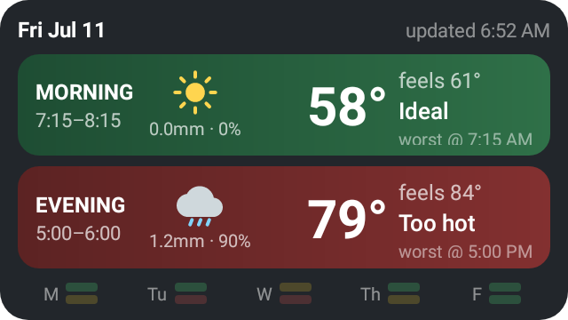
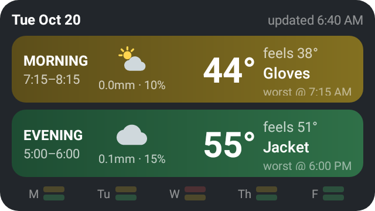

# Commute Weather Widget

An Android home-screen widget that answers one question every morning: **what will the ride
actually feel like?** It reads the forecast for your morning and evening commute windows and,
for each, surfaces the worst-feeling moment — so the bike-vs-drive call takes one glance
instead of a scrub through an hourly forecast.

<p align="center">
  
</p>

A green morning and a red evening, at a glance: lovely ride in, but you'll come home hot and
soaked — maybe drive today, or plan to leave early. *(Images are real widget renders from the Robolectric screenshot tests.)*

## Decision support, not an oracle

There is deliberately **no BIKE/DRIVE verdict**. The widget shows two independent rows —
morning and evening — and you integrate them with everything it can't know: your schedule,
school drop-off, evening plans, whether the bike can sleep at the office. The color alerts,
the numbers explain:

- **Row tint** — a green/yellow/red "bikeability" severity, the worse of temperature comfort
  and precipitation. Redder = worse for biking.
- **Worst hour** — the hour whose *feels-like* is furthest from your ideal balance point
  (default 60 °F), in either direction. Shown with its air temp, feels-like, and when it
  hits, so you can consider shifting your departure.
- **Gear category** — Too cold / Gloves / Jacket / Ideal / Shorts / Too hot, driven by
  feels-like against your personal gear lines ("below 55 °F I want a jacket", "above 68 °F
  I ride in shorts and change at work").
- **Precipitation** — the window's peak probability and peak rate under the sky pictograph.
  An ideal-temperature row can still be red: "Ideal · 1.2mm · 90%" is a rain problem, not a
  clothing problem.

<p align="center">
  
</p>

Shoulder season: gloves in the morning (yellow — rideable, but gear up), plain jacket weather
coming home (green). Both rows fine; the widget stays out of the way.

## The feels-like model

The number that drives everything is a cyclist-specific apparent temperature — Steadman's
radiation-inclusive formula fed an **effective cycling airspeed**: the quadrature of your
cruising speed (default 16 mph) and the ambient wind. Consequences the widget gets right that
a weather app doesn't:

- A calm 37 °F morning **feels like ~23 °F** at cycling speed — gloves country, flagged red.
- Full noon sun adds a few degrees over the shade value; overcast days don't (sun enters via
  shortwave radiation, so cloud cover is captured implicitly).
- Humidity counts in exactly the 50–80 °F band where NWS heat index and wind chill are both
  undefined.

Forecasts come from [Open-Meteo](https://open-meteo.com) (free, no API key) for **both** home
and work in one request; each window takes the worse of the two endpoints, which catches the
downtown heat-island bump and the frost-pocket start street without any routing logic.

Full design rationale lives in [the spec](commute-weather-widget-spec.md).

## Building

```bash
./gradlew :app:testDebugUnitTest   # engine tests (golden cases from the spec) + widget screenshot tests
./gradlew :app:assembleDebug       # APK at app/build/outputs/apk/debug/app-debug.apk
```

The screenshot tests render the real Glance widget through its actual RemoteViews translation
(Robolectric native graphics, no emulator needed) and write PNGs to
`app/build/reports/widget-screenshots/` — check them after UI changes; they catch layout bugs
mocks can't, like Glance's 10-children-per-container truncation. The README images come from
these tests.

Requires JDK 17 and an Android SDK (platform 35); point `local.properties` `sdk.dir` at it.
Min Android 8.0 (API 26). Stack: Kotlin, Jetpack Glance, WorkManager, DataStore, Compose, Ktor.

## Configure & calibrate

Tap the widget to open settings: home/work locations (address lookup or raw lat/lon), window
times, cruising speed, and every threshold. Two knobs benefit from real-world calibration —
`solarGainK` (how much blazing sun adds) and your gear lines. The settings screen shows the
worst hour's feels-like broken into components (base + humidity − wind + sun − constant) so
after a ride that felt wrong, it's obvious which knob to nudge.

## Layout

- `domain/` — pure comfort engine, no Android imports; unit-tested against the spec's golden cases
- `data/` — Open-Meteo client + DTOs + repository
- `config/` — user config, JSON in Preferences DataStore
- `widget/` — Glance widget, WorkManager refresh, stale-cache fallback
- `settings/` — Compose settings screen, Geocoder location entry, calibration readout
